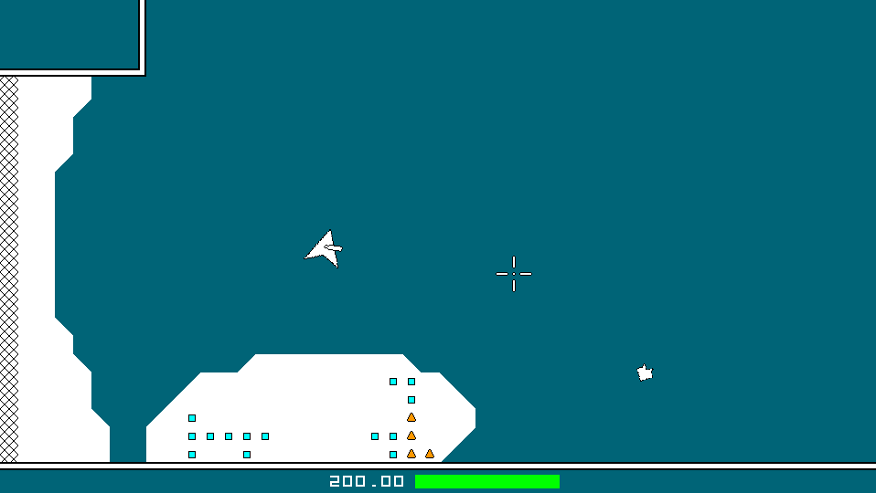
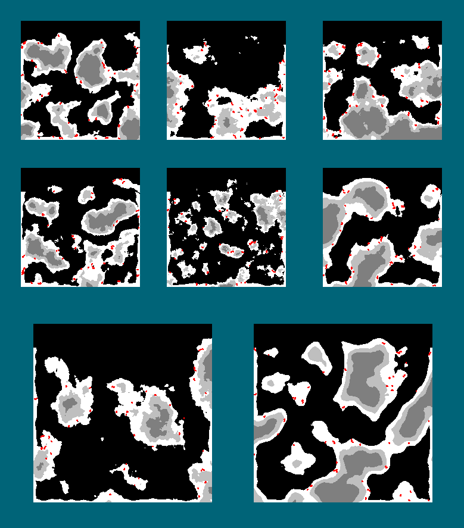

# ProjectSpaceMiner
\
**Overview:**\
\
A 2D shmup (shoot-em'-up) indie game, with heavy emphasis on environment exploration achieved by utilizing procedural generation every where possible.\
\
MVP/V1 TO DOS:\
- Terrain (level) generation.  Current primary focus for procedural generation.\
- Resource generation within terrain (the "ore" to be mined).  Current tertiary focus for procedural generation.\
- Introductory set of enemies.  Each with behavior and generation procedurally generated variables (secondary focus).\
- Ship with movement, health, and basic attack.\
- Gameplay HUD to accomodate for all previous to dos.\
- Basic menu to allow for level generation and gameplay.\
\
\
\
**Latest gameplay example (posted on 2023-  -  ):**\
\
\
\
\
\
**Example pics of level generation (posted on 2023-  -  ):**\
\
\
\
\
\

